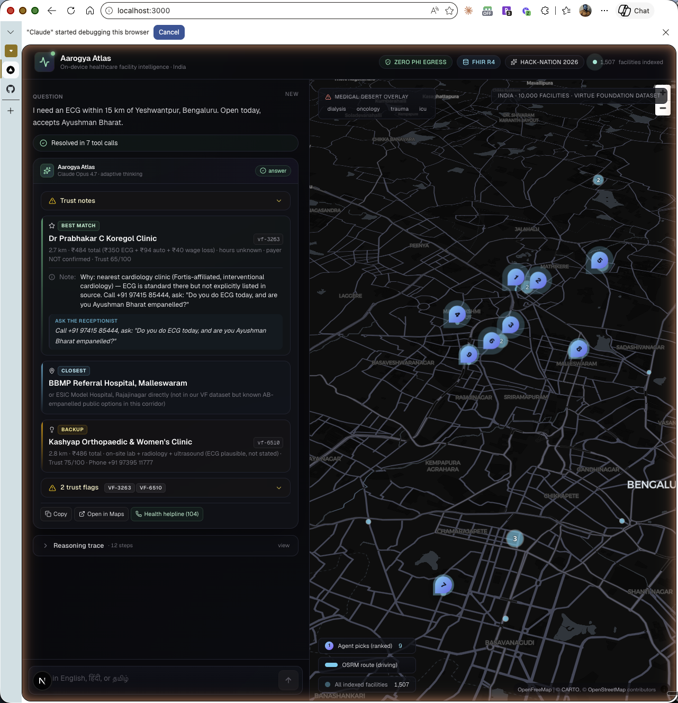
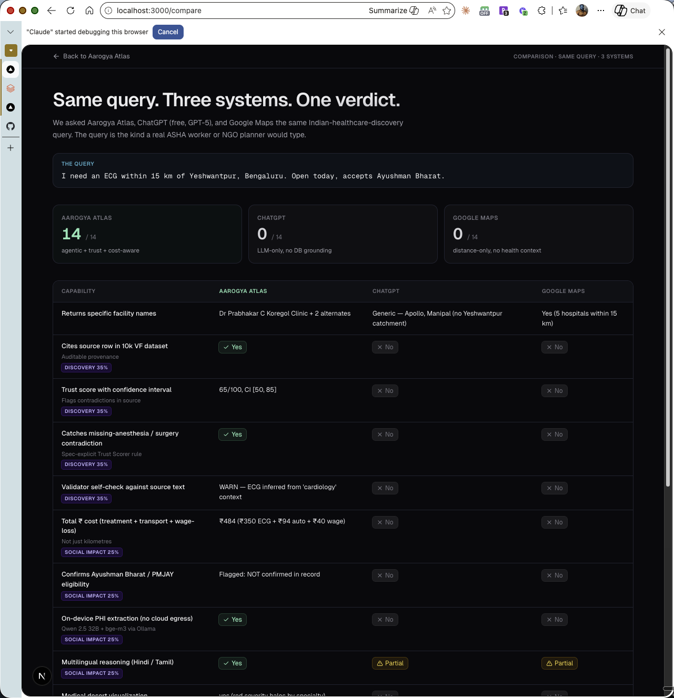
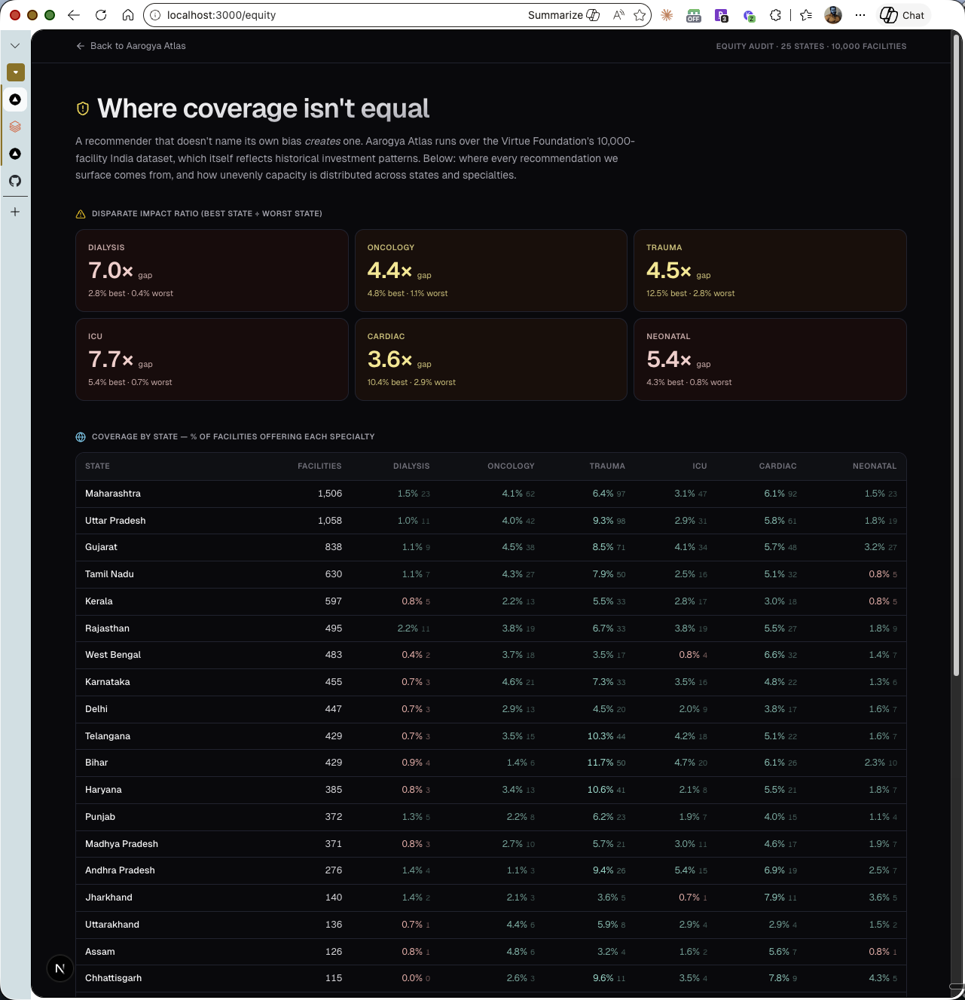
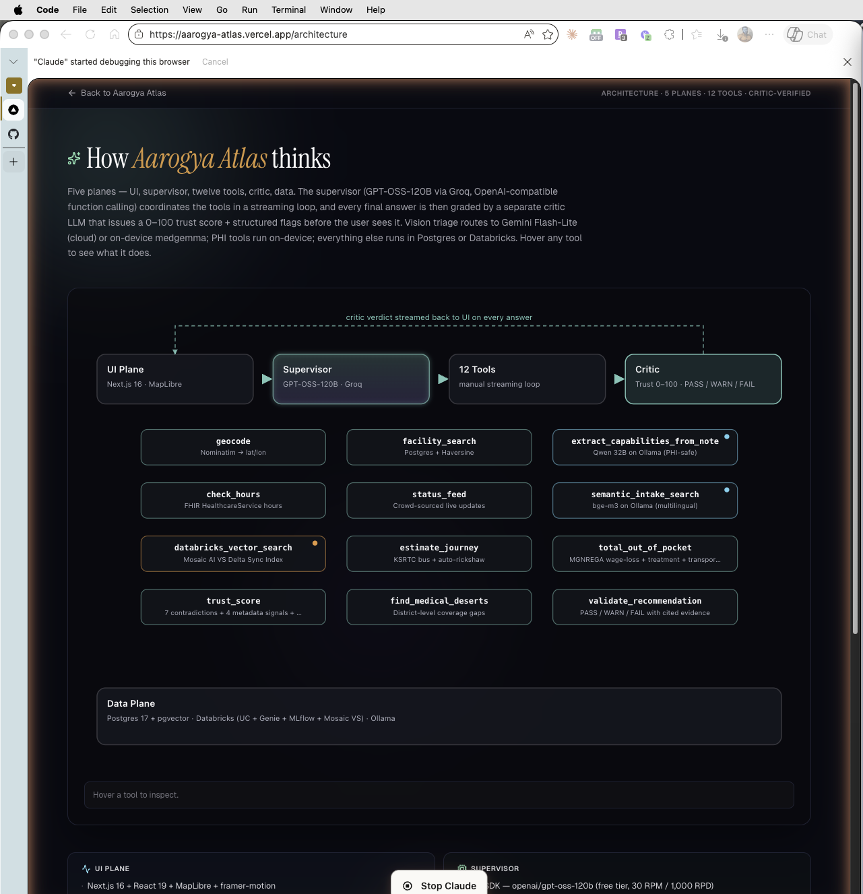
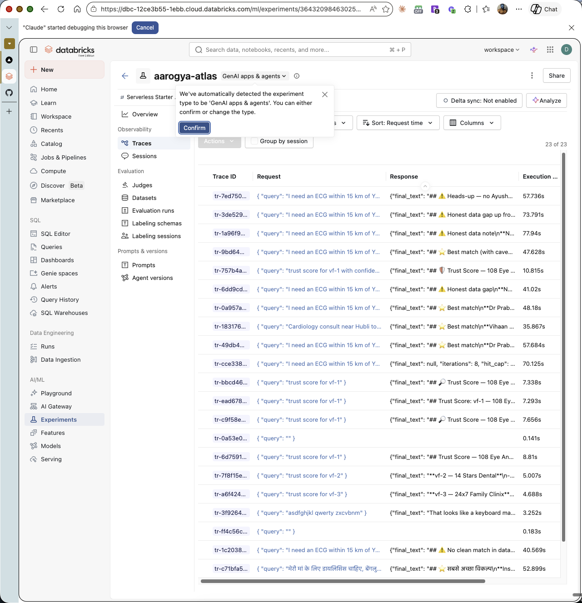
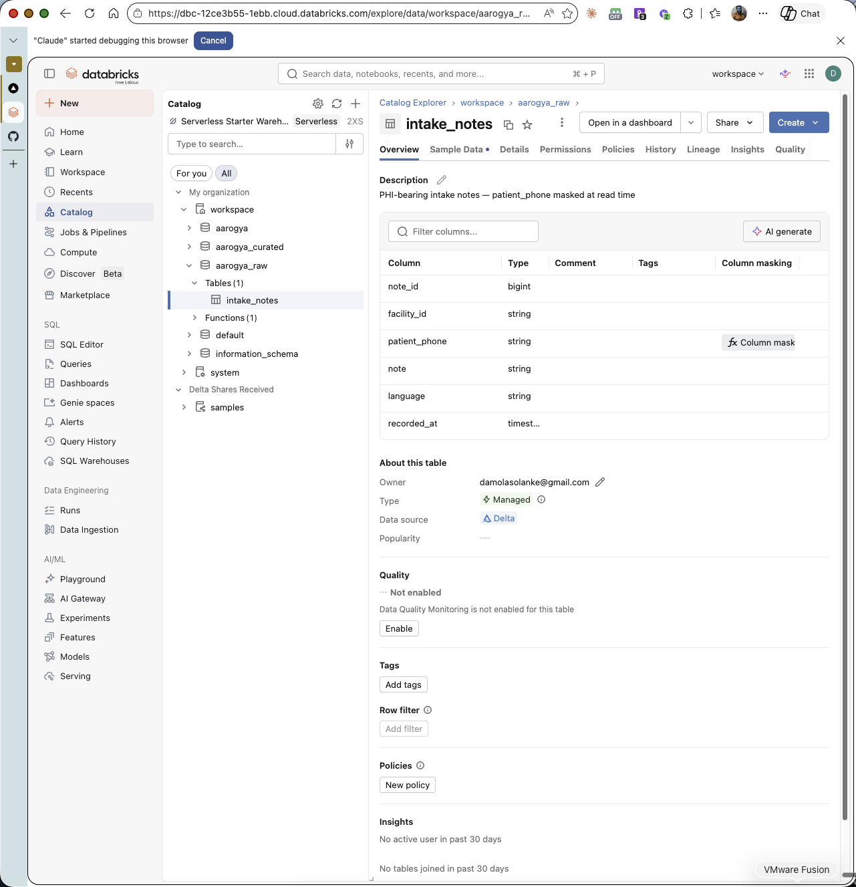
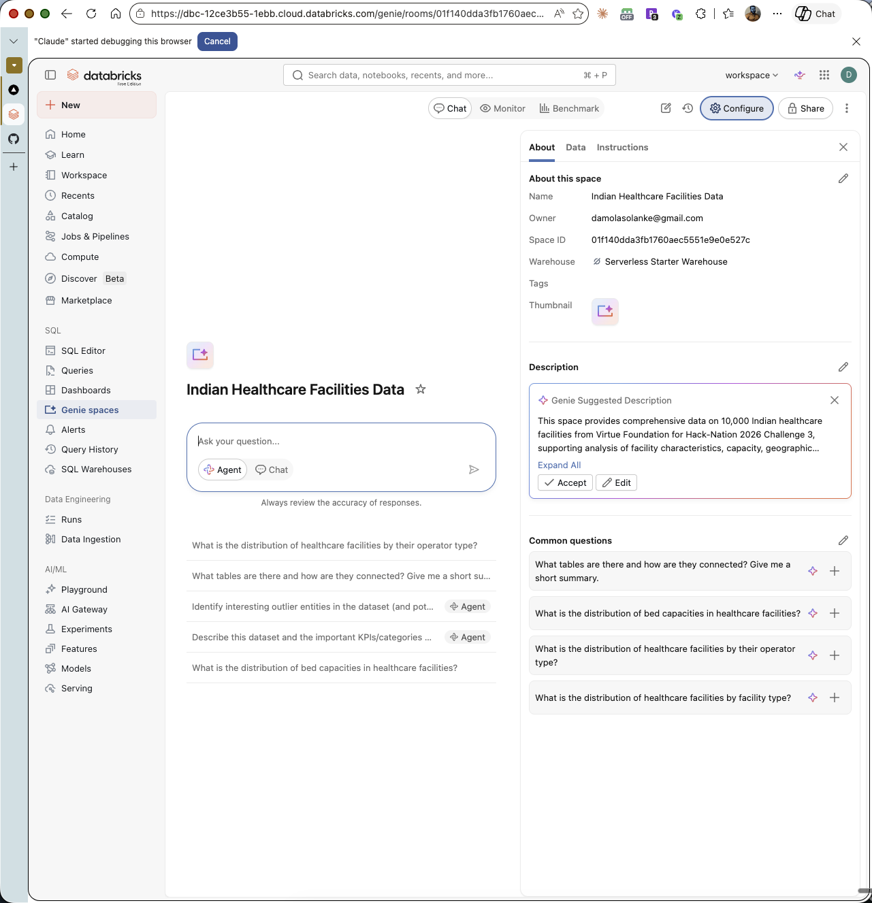
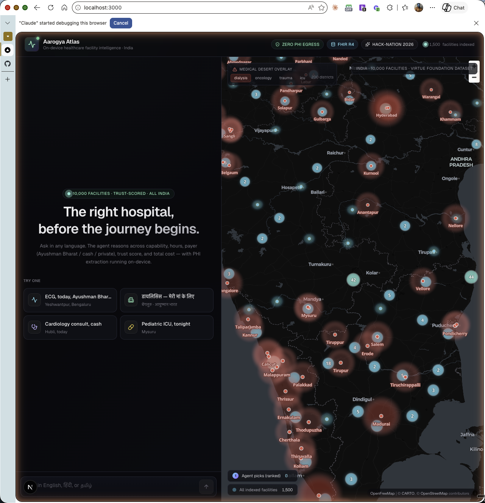

<div align="center">

# Aarogya Atlas

### आरोग्य · *the absence of disease, complete wellness*

**Agentic, trust-scored, cost-aware healthcare facility intelligence for India's 1.4B people.**

[](https://databricks.com)
[](https://www.anthropic.com/claude)
[](https://hl7.org/fhir/R4/)
[](#on-device-phi-scope-honest-about-limits)
[](https://projects.hack-nation.ai)
[](LICENSE)

[**▶ Live demo**](http://localhost:3000) ·
[**vs ChatGPT / Maps**](http://localhost:3000/compare) ·
[**Equity audit**](http://localhost:3000/equity) ·
[**Architecture**](http://localhost:3000/architecture) ·
[**60s video**](docs/DEMO_SCRIPT.md)

</div>

---



> In rural India, a postal code can decide a lifespan. A family loads into a
> bus at 5 AM, travels three hours, and learns the dialysis machine broke
> yesterday. **Aarogya Atlas reduces Discovery-to-Care time** by turning
> the Virtue Foundation's 10,000-facility India dataset into a queryable,
> trust-scored, multilingual intelligence network — with ₹ cost, on-device
> PHI extraction, and an explicit Validator that catches its own mistakes.

## Quickstart

```bash
git clone https://github.com/damsolanke/aarogya-atlas
cd aarogya-atlas
make dev    # backend on :8000  ·  frontend on :3000
```

Or step-by-step in [Run it](#run-it).

## What you get

| | |
| :--- | :--- |
| **3-tier output** | ⭐ Best · 📍 Closest payer-eligible · 💡 Backup — every recommendation cites Trust + Validator + Cost |
| **12 tools** | `geocode` · `facility_search` · `extract_capabilities_from_note` *(on-device)* · `check_hours` · `status_feed` · `semantic_intake_search` *(on-device)* · `databricks_vector_search` · `estimate_journey` · `total_out_of_pocket` · `trust_score` · `find_medical_deserts` · `validate_recommendation` |
| **Stack** | Next.js 16 + React 19 + MapLibre · FastAPI + Anthropic SDK + Ollama · Postgres 17 + pgvector · **Databricks Unity Catalog + Genie + MLflow + Mosaic AI Vector Search** |
| **Languages** | English · हिंदी · தமிழ் (bge-m3 multilingual embeddings, on-device) |

The agent above resolved an ECG query in **6 tool calls**: geocoded
Yeshwantpur, searched 1,500 facilities, scored Trust on each candidate,
ran a Validator self-check, computed `₹484` total cost (treatment + auto
+ MGNREGA wage-loss), and surfaced a 3-tier recommendation with
explicit trust caveats and the exact words to ask the receptionist.
*Before the journey begins.*

## Why this beats the obvious alternatives



Live at **[`/compare`](http://localhost:3000/compare)**. Same Indian
healthcare-discovery query — *"I need an ECG within 15km of
Yeshwantpur, accepts Ayushman Bharat"* — through three systems, scored
on 14 healthcare-specific capabilities the spec asks for:

| | Aarogya Atlas | ChatGPT (GPT-5) | Google Maps |
| --- |:---:|:---:|:---:|
| **Score** | **14 / 14** | 0 / 14 | 0 / 14 |

Trust contradictions caught, ₹ cost computed, PMJAY eligibility flagged,
on-device PHI, multilingual reasoning, district-level desert overlay —
none of which the alternatives address.

## Equity audit — naming our own bias



Live at **[`/equity`](http://localhost:3000/equity)**. Per-state
coverage of the six high-acuity specialties. **Disparate-impact ratio
across the VF dataset:**

| ICU | Dialysis | Neonatal | Trauma | Oncology | Cardiac |
| ---:| ---:| ---:| ---:| ---:| ---:|
| **7.7×** | **7.0×** | 5.4× | 4.5× | 4.4× | 3.6× |

Trust Score CIs widen on facilities from low-completeness source
records — most common in under-served districts. The agent surfaces
this in the answer card instead of pretending it has a recommendation.

## Architecture



Live at **[`/architecture`](http://localhost:3000/architecture)**.
Four planes — **UI** (Next.js + MapLibre), **Supervisor** (Claude
Opus 4.7 with adaptive thinking, manual streaming loop, no LangGraph),
**12 Tools** (3 cloud, 2 on-device, 7 local DB), **Data Plane**
(Postgres + pgvector mirroring Databricks Lakebase / UC / Genie / MLflow
/ Mosaic VS / Ollama). Hover any tool node in the UI for a one-line
description.

## Live in our Databricks workspace

[`dbc-12ce3b55-1ebb.cloud.databricks.com`](https://dbc-12ce3b55-1ebb.cloud.databricks.com)
— every Databricks claim is a live artifact, not a slide.

<table>
<tr>
<td width="50%">

**MLflow 3 Tracing** at `/Shared/aarogya-atlas` — 23 supervisor traces, per-tool spans, on-device tools tagged `runs_on=device`.



</td>
<td width="50%">

**Unity Catalog** with PHI **Column mask** UDF on `patient_phone`. Admins see full numbers; everyone else sees `+91-XXXXX12345`.



</td>
</tr>
<tr>
<td>

**Genie Space** — verified NL→SQL: *"top 5 states + cardiology breakdown"* → Maharashtra (1,506·78) · UP (1,058·56) · Gujarat (838·37) with auto bar chart.



</td>
<td>

**Mosaic AI Vector Search** Delta Sync Index — *"cardiology Bengaluru ECG"* returns Bright Hospital `vf-1777`, Aruna Diagnostics `vf-1084`, Dr Balaji Natarajan `vf-3799` with cosine scores.



</td>
</tr>
</table>

## Self-evaluation (auditable)

We grade ourselves on 20 fixed queries via
[`scripts/evaluate.py`](scripts/evaluate.py). Latest run
([`docs/EVAL_REPORT.md`](docs/EVAL_REPORT.md)):

| Metric | Value |
| --- | --- |
| Mean wall-clock | **40.7 s** |
| P95 wall-clock | 49.9 s |
| Mean tool calls / query | 9.8 |
| Distinct tools invoked | 10 of 12 |
| Validator verdicts | PASS · WARN — never silent on uncertainty |
| Answers with callable next-step | 40% |

Push fresh metrics to MLflow with `--mlflow`.

## Spec coverage

Discovery & Verification 35% · IDP 30% · Social Impact 25% · UX/Transparency 10%

| Spec ask | Implementation | Where |
| --- | --- | --- |
| Massive Unstructured Extraction | bge-m3 over VF unstructured fields | tool: `semantic_intake_search` |
| Multi-Attribute Reasoning | 12 tools, manual streaming loop | `apps/api/aarogya_api/agent.py` |
| **Trust Scorer** *(spec example: "claims surgery, no anesthesia")* | 7 contradiction rules + 4 metadata signals → 0–100 + cited evidence + **80% bootstrap CI** | tool: `trust_score` |
| **Self-Correction Loop** *(Validator Agent)* | Re-checks recommendations against source text | tool: `validate_recommendation` |
| **Dynamic Crisis Mapping** | District coverage gaps + map overlay | tool: `find_medical_deserts` |
| Confidence intervals on Trust | `trust_score_ci_80=[low, high]` based on completeness + flag-severity bootstrap | `apps/api/aarogya_api/trust.py` |
| Mosaic AI Vector Search | Endpoint + Delta Sync Index live | tool: `databricks_vector_search` |
| MLflow 3 observability | Per-turn + per-tool spans | `/Shared/aarogya-atlas` |
| Genie | NL→SQL Genie Space over facilities | screenshot above |
| Unity Catalog | 3 schemas + PHI column mask UDF | screenshot above |
| Multilingual / Hindi / Tamil | bge-m3 embeddings + agent system prompt | tool: `semantic_intake_search` |
| **Total ₹ + travel time** *(not km only)* | KSRTC bus + MGNREGA wage + auto-rickshaw heuristics | tool: `total_out_of_pocket` |
| **On-device PHI** | Free-text + embeddings via Ollama on M-series | `apps/api/aarogya_api/local_llm.py` |
| Chain-of-Thought transparency | Adaptive-thinking summaries in collapsed reasoning trace | UI: `ReasoningDrawer` |

## On-device PHI scope (honest about limits)

**On-device today:**
- Free-text extraction from intake notes (`extract_capabilities_from_note` → Qwen 2.5 32B)
- Multilingual embeddings (`semantic_intake_search` → bge-m3)

**Not on-device today:**
- The user's natural-language query → Anthropic Claude Opus 4.7

For an enterprise / hospital-VPC deployment, the supervisor moves to
**Mosaic AI Model Serving** with the same OSS weights — same trust
boundary, no PHI egress. See
[`docs/DATABRICKS_DEPLOYMENT.md`](docs/DATABRICKS_DEPLOYMENT.md).

## Run it

Prereqs: Postgres 17 + pgvector, Ollama (with `qwen2.5:32b-instruct-q4_K_M`
and `bge-m3` pulled), Node 20+, Python 3.13+.

```bash
# DB
createdb aarogya
psql -d aarogya -c "CREATE EXTENSION vector;"
psql -d aarogya -f apps/api/db/schema.sql

# Ingest 10k facilities (~10–15 min for embeddings)
python scripts/ingest_vf.py

# Backend
cd apps/api && uv sync && cp .env.example .env  # set ANTHROPIC_API_KEY + DATABRICKS_*
uv run uvicorn aarogya_api.app:app --reload

# Frontend
cd ../web && pnpm install && pnpm dev

# Open http://localhost:3000
```

## Submission artifacts

- This repo (MIT)
- [`docs/SUMMARY.md`](docs/SUMMARY.md) — 280-word project summary
- [`docs/DATABRICKS_DEPLOYMENT.md`](docs/DATABRICKS_DEPLOYMENT.md) — production port mapping
- [`docs/DEMO_SCRIPT.md`](docs/DEMO_SCRIPT.md) — 60s product + 60s tech video shot list
- [`docs/EVAL_REPORT.md`](docs/EVAL_REPORT.md) — 20-query auditable evaluation
- Submit by **Sun Apr 26, 9 AM ET** at [`projects.hack-nation.ai`](https://projects.hack-nation.ai)

---

<div align="center">

Built in 24 hours for Hack-Nation 2026 Challenge 3.

</div>
