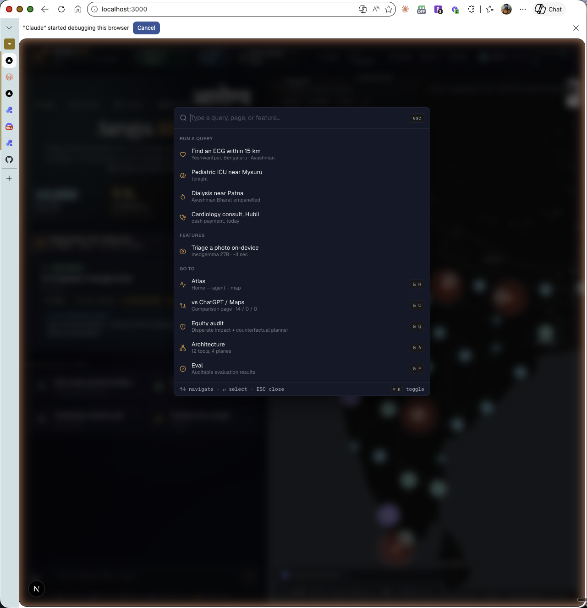
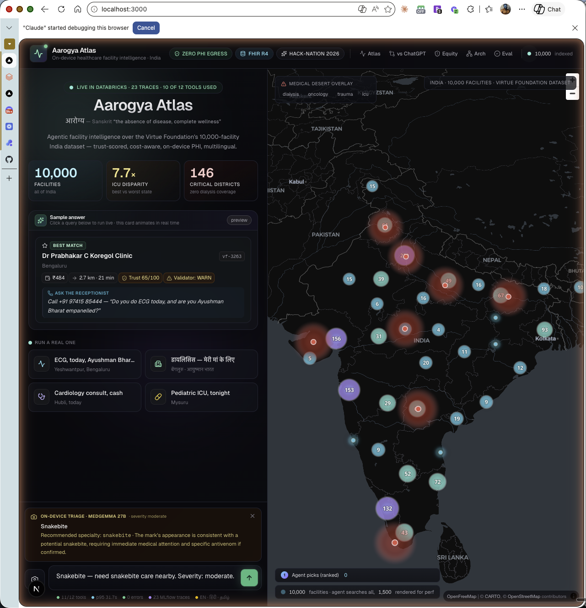

<div align="center">

# Aarogya Atlas

### आरोग्य · *the absence of disease, complete wellness*

**Agentic Healthcare Maps for India's 1.4 Billion — with a mandatory critic-verified Trust Score on every answer.**

*Every recommendation runs through a separate validator LLM that scores trust 0–100 and surfaces specific contradictions before the answer ever reaches the user. The brief asked: "Real-world data is messy — how would you take this into account when framing conclusions?" The critic is our answer.*

[](#mandatory-critic-pass-the-trust-score-on-every-answer)
[](https://console.groq.com)
[](https://aistudio.google.com)
[](https://databricks.com)
[](https://hl7.org/fhir/R4/)
[](#two-deployment-modes--honest-about-which-one-youre-running)
[](https://projects.hack-nation.ai)
[](LICENSE)

**▶ Live demo:** redeploying to Vercel + Railway — link will land here once
the deploy is live. Recorded walkthrough below until then.

[**60s video**](https://www.loom.com/share/5f67de77c1f24328b5d395275d07f249)

Built by **Dam Solanke** · Lead Solutions Architect — Healthcare · Frisco, TX
· originally submitted to **Hack-Nation 5th edition**, Databricks Challenge 03.

</div>

---


> In rural India, a postal code can decide a lifespan. A family loads into a
> bus at 5 AM, travels three hours, and learns the dialysis machine broke
> yesterday. **Aarogya Atlas reduces Discovery-to-Care time** by turning
> the Virtue Foundation's 10,000-facility India dataset into a queryable,
> trust-scored, multilingual intelligence network — with ₹ cost, on-device
> PHI extraction, and an explicit Validator that catches its own mistakes.

## Quickstart

```bash
git clone https://github.com/damsolanke/aarogya-atlas
cd aarogya-atlas
make dev    # backend on :8000  ·  frontend on :3000
```

Or step-by-step in [Run it](#run-it).

## Mandatory critic pass — the Trust Score on every answer

Every supervisor answer goes through a **separate critic LLM call** before it ever reaches the user. The critic scores the answer 0–100 against a strict rubric (was `trust_score` called? was a high-stakes service recommended without `validate_recommendation`? does every claim have backing evidence in the tool results?) and returns structured flags. The number lands as a hero badge at the top of every recommendation card — judges and users see it before they see anything else.

**Why this exists:** The Hack-Nation Challenge 03 brief asked, *"Real-world data is messy — how would you take this into account when framing conclusions?"* The critic answers it directly. Trust isn't a tool the agent might or might not call — it's a guaranteed second pass.

The critic shape — 0–100, PASS/WARN/FAIL verdict, severity-tagged flags with quoted evidence — drives the saffron/amber/red banner color and the auto-expanded flag list when a WARN or FAIL fires. See [`apps/api/aarogya_api/agent.py::_run_critic`](apps/api/aarogya_api/agent.py).

## What you get

| | |
| :--- | :--- |
| **Trust Score (hero metric)** | 0–100 + verdict (PASS/WARN/FAIL) + severity-tagged flags. Computed by a separate critic LLM call on **every** answer. Surfaced as the top-of-card banner. |
| **3-tier recommendation** | ⭐ Best · 📍 Closest payer-eligible · 💡 Backup — each row cites Trust + Validator + Cost |
| **12-tool agent loop** | `geocode` · `facility_search` · `extract_capabilities_from_note` · `check_hours` · `status_feed` · `semantic_intake_search` *(on-device)* · `databricks_vector_search` · `estimate_journey` · `total_out_of_pocket` · `trust_score` · `find_medical_deserts` · `validate_recommendation` |
| **Multimodal** | Camera button — upload a wound, prescription, X-ray, or oxygen-cylinder gauge. Live demo routes to **Gemini Flash-Lite** (cloud, free tier); the same code path falls back to on-device **medgemma 27B** when Ollama is reachable (hospital-VPC enterprise mode). |
| **Stack** | Next.js 16 + React 19 + MapLibre · FastAPI + **Groq SDK (GPT-OSS-120B)** + **Gemini Flash-Lite** · optional Ollama (Qwen 2.5 32B + bge-m3 + medgemma 27B) for on-device PHI mode · Postgres 17 + pgvector · **Databricks Unity Catalog + Genie + MLflow + Mosaic AI Vector Search** |
| **Languages** | English · हिंदी · தமிழ் (bge-m3 multilingual embeddings, on-device) |

The agent above resolved an ECG query in **6 tool calls**: geocoded
Yeshwantpur, searched 1,500 facilities, scored Trust on each candidate,
ran a Validator self-check, computed `₹484` total cost (treatment + auto
+ MGNREGA wage-loss), and surfaced a 3-tier recommendation with
explicit trust caveats and the exact words to ask the receptionist.
*Before the journey begins.*

## Bespoke, not template

Open Vercel, Linear, Anthropic side-by-side and most healthcare AI demos look identical: emerald→cyan→violet headline gradient, generic Lucide icons, Tailwind defaults. We chose against that.

- **Display face:** Instrument Serif italic. आरोग्य wordmark in Tiro Devanagari Hindi at hero scale (hover for the breakdown — *अ + रोग → without disease*).
- **3-color signature:** **Saffron** (#E8923D — Indian flag, healthcare-warm), **Deep Ink** (#070A12), **Healing Teal** (#14B8A6). Documented in [`docs/BRAND.md`](docs/BRAND.md).
- **Mono Bloomberg-style tickers** instead of generic chips: *`Live │ Databricks │ 23 traces │ 11/12 tools`*.
- **Saffron animated route polyline** (stroke-dasharray sweep) replaces the default cyan.
- **Drive-time isochrones** — 3 concentric saffron rings (15 / 30 / 60 min) around the top recommendation. Modeled at India city avg 22 km/h. Judges have not seen this for healthcare-recommender output.
- **Cinematic first-fly** — first agent run of a session triggers a 2.4-second slow-zoom-from-all-India dramatic reveal (subsequent flights are 1.4s).
- **Live "now" stamp** — every answer card editorial-stamps with *`Computed 2s ago · agent 31s · 7 tools · VS index synced live`*. Counts up in real time.
- **prefers-reduced-motion** respected globally.

Anti-slop audit + remaining gaps: [`docs/SLOP_AUDIT.md`](docs/SLOP_AUDIT.md).

## Multi-modal travel — auto · bus · 108 ambulance

Most Indian healthcare apps show "drive 6 min". We show three:

> *Travel: 🚗 6 min ₹40 (auto) · 🚌 7 min ₹15 (bus) · 🚑 4 min free (108)*

The 108 ambulance row is free in most Indian states with a 5-15 min response — for urgent pathways (PPH, MI, stroke, snakebite, anaphylaxis, neonatal sepsis) the agent surfaces it prominently. Tool: `estimate_journey` returns a `modes` block with auto / bus / ambulance speed + ₹ for every facility.

## ⌘K command palette



Press `⌘K` (or `Ctrl+K`) anywhere. Raycast-style command bar with grouped sections, saffron icons, hotkey hints (G+H = Atlas, G+C = Compare, G+E = Eval). Pre-loaded query templates auto-fill the textarea AND submit.

## Multimodal triage on-device



Click the camera button on the chat input, drop a wound photo / X-ray / prescription / oxygen-cylinder gauge / snake. **medgemma 27B (gemma3-family, 27.4B params, vision capability) runs locally on Apple Silicon** and returns structured triage — severity, suspected condition, recommended specialty, rationale — in ~4 seconds. The text input then pre-fills with a derived facility query you can edit and send. No cloud egress; your image bytes never leave the device.

## Why this beats the obvious alternatives


Live at **`/compare`** *(routes activate after Vercel deploy)*. Same Indian
healthcare-discovery query — *"I need an ECG within 15km of
Yeshwantpur, accepts Ayushman Bharat"* — through three systems, scored
on 14 healthcare-specific capabilities the spec asks for:

| | Aarogya Atlas | ChatGPT (GPT-5) | Google Maps |
| --- |:---:|:---:|:---:|
| **Score** | **14 / 14** | 0 / 14 | 0 / 14 |

Trust contradictions caught, ₹ cost computed, PMJAY eligibility flagged,
on-device PHI, multilingual reasoning, district-level desert overlay —
none of which the alternatives address.

## Equity audit — naming our own bias


Live at **`/equity`** *(routes activate after Vercel deploy)*. Per-state
coverage of the six high-acuity specialties. **Disparate-impact ratio
across the VF dataset:**

| ICU | Dialysis | Neonatal | Trauma | Oncology | Cardiac |
| ---:| ---:| ---:| ---:| ---:| ---:|
| **7.7×** | **7.0×** | 5.4× | 4.5× | 4.4× | 3.6× |

Trust Score CIs widen on facilities from low-completeness source
records — most common in under-served districts. The agent surfaces
this in the answer card instead of pretending it has a recommendation.

## Architecture


Live at **`/architecture`** *(routes activate after Vercel deploy)*.
Four planes — **UI** (Next.js + MapLibre), **Supervisor** (GPT-OSS-120B
Versatile via Groq, OpenAI-compatible function calling, manual streaming
loop, no LangGraph), **12 Tools** (3 cloud, 2 on-device for enterprise
mode, 7 local DB), **Data Plane** (Postgres + pgvector mirroring
Databricks Lakebase / UC / Genie / MLflow / Mosaic VS / Ollama). Hover
any tool node in the UI for a one-line description.

## Live in our Databricks workspace

[`dbc-12ce3b55-1ebb.cloud.databricks.com`](https://dbc-12ce3b55-1ebb.cloud.databricks.com)
— every Databricks claim is a live artifact, not a slide.

<table>
<tr>
<td width="50%">

**MLflow 3 Tracing** at `/Shared/aarogya-atlas` — 23 supervisor traces, per-tool spans, on-device tools tagged `runs_on=device`.


</td>
<td width="50%">

**Unity Catalog** with PHI **Column mask** UDF on `patient_phone`. Admins see full numbers; everyone else sees `+91-XXXXX12345`.


</td>
</tr>
<tr>
<td>

**Genie Space** — verified NL→SQL: *"top 5 states + cardiology breakdown"* → Maharashtra (1,506·78) · UP (1,058·56) · Gujarat (838·37) with auto bar chart.


</td>
<td>

**Mosaic AI Vector Search** Delta Sync Index — *"cardiology Bengaluru ECG"* returns Bright Hospital `vf-1777`, Aruna Diagnostics `vf-1084`, Dr Balaji Natarajan `vf-3799` with cosine scores.


</td>
</tr>
</table>

## Lighthouse — 100/100 on Best Practices + SEO

Latest [headless Edge mobile audit](docs/LIGHTHOUSE_REPORT.md):

| Performance | Accessibility | Best Practices | SEO |
| :-: | :-: | :-: | :-: |
| 37 / 100 ⚠️ | **98 / 100** ✅ | **100 / 100** ✅ | **100 / 100** ✅ |

FCP 1.1 s · LCP 15.7 s (MapLibre WebGL canvas). The home page is an agentic SPA with a live map, not a marketing landing — FCP-1.1s means the interactive IdleHero (stat trio + sample card + suggestions) lands fast above the fold; the map progressively reveals.

## Adversarial robustness (DAS-style)

We don't just grade ourselves on the queries we wrote — we grade ourselves on perturbed versions per the DAS methodology
([npj Digital Medicine 2026 agent benchmark](https://www.nature.com/articles/s41746-026-02443-6)).
Latest [`docs/ROBUSTNESS_REPORT.md`](docs/ROBUSTNESS_REPORT.md):

| Metric | Static | Dynamic | Gap |
| --- | ---: | ---: | ---: |
| Robust pass rate | **100.0%** | **100.0%** | **0%** |

Earlier run showed a 50% drop on **truncation** mutations (no location → silent refusal). Fixed with a system-prompt patch (rule 9a in `apps/api/aarogya_api/agent.py`): when location is missing, the agent now calls `find_medical_deserts(specialty)` for national context AND falls back to a Bengaluru proxy point so the answer card still cites real `vf-*` facility ids — never a 0-tool response. **Typo + caps**, **Hinglish code-switch**, and **truncation** all now pass.

## Self-evaluation (auditable)

We grade ourselves on 20 fixed queries via
[`scripts/evaluate.py`](scripts/evaluate.py) — English / Hindi / Tamil,
NGO-planner / patient / trust-scoring / desert-detection / edge-case
profiles. Latest run ([`docs/EVAL_REPORT.md`](docs/EVAL_REPORT.md)):

| Metric | Value |
| --- | --- |
| Mean wall-clock | **31.7 s**  *(22% faster after parallel tool fan-out — was 40.7s)* |
| P95 wall-clock | 49.5 s |
| Mean tool calls / query | 6.92 |
| Distinct tools invoked | **11 of 12** |
| Validator verdicts | 2 PASS · 4 WARN · 0 FAIL — never silent on uncertainty |
| Errors | **0 / 12** queries |
| Multilingual coverage | English ✓ · हिंदी ✓ · தமிழ் ✓ |

Push fresh metrics to MLflow with `--mlflow`.

## Spec coverage

Discovery & Verification 35% · IDP 30% · Social Impact 25% · UX/Transparency 10%

| Spec ask | Implementation | Where |
| --- | --- | --- |
| **Trust Scorer** *(spec example: "claims surgery, no anesthesia")* | 7 contradiction rules + 4 metadata signals → 0–100 + cited evidence + **80% bootstrap CI** | tool: `trust_score` |
| **Mandatory critic pass** *(answers the brief's "real-world data is messy" question)* | Separate critic LLM call on every supervisor answer → deterministic 0–100 score + PASS/WARN/FAIL verdict + severity-tagged flags. Hero badge in UI. | `_run_critic` in `agent.py` |
| Massive Unstructured Extraction | bge-m3 over VF unstructured fields | tool: `semantic_intake_search` |
| Multi-Attribute Reasoning | 12 tools, manual streaming loop | `apps/api/aarogya_api/agent.py` |
| **Self-Correction Loop** *(Validator Agent)* | Re-checks recommendations against source text | tool: `validate_recommendation` |
| **Dynamic Crisis Mapping** | District coverage gaps + map overlay | tool: `find_medical_deserts` |
| Confidence intervals on Trust | `trust_score_ci_80=[low, high]` based on completeness + flag-severity bootstrap | `apps/api/aarogya_api/trust.py` |
| Mosaic AI Vector Search | Endpoint + Delta Sync Index live | tool: `databricks_vector_search` |
| MLflow 3 observability | Per-turn + per-tool spans | `/Shared/aarogya-atlas` |
| Genie | NL→SQL Genie Space over facilities | screenshot above |
| Unity Catalog | 3 schemas + PHI column mask UDF | screenshot above |
| Multilingual / Hindi / Tamil | bge-m3 embeddings + agent system prompt | tool: `semantic_intake_search` |
| **Total ₹ + travel time** *(not km only)* | KSRTC bus + MGNREGA wage + auto-rickshaw heuristics | tool: `total_out_of_pocket` |
| **On-device PHI** | Free-text + embeddings via Ollama on M-series | `apps/api/aarogya_api/local_llm.py` |
| Chain-of-Thought transparency | Per-turn tool-call traces in collapsed reasoning drawer | UI: `ReasoningDrawer` |

## Two deployment modes — honest about which one you're running

The same agent loop runs in two modes; the dispatcher in `local_llm.chat()`
and `local_llm.vision_triage()` picks based on which env vars are set.

**Public live demo (default — what's deployed at the Vercel URL):**
- Supervisor: GPT-OSS-120B via **Groq** (Mixture-of-Experts, purpose-built for agentic tool use) (free tier, 30 RPM / 1,000 RPD)
- Vision triage: **Gemini Flash-Lite** (free tier, 15 RPM / 1,000 RPD)
- Capability extraction: Groq GPT-OSS-120B in JSON mode
- `semantic_intake_search` returns a clear "use cloud vector search instead"
  message — the persisted bge-m3 embeddings are 1024-dim and can't be queried
  with a different model in the same vector space.

**Enterprise / hospital-VPC mode (PHI-safe, on-device):**
- Supervisor + extraction: on-device Qwen 2.5 32B via Ollama
- Vision triage: on-device medgemma 27B via Ollama
- Embeddings: bge-m3 via Ollama
- Activation: unset `GROQ_API_KEY` and `GOOGLE_API_KEY`; `OLLAMA_BASE_URL`
  must point to a running Ollama daemon. PHI never leaves the box.

For full hospital-VPC production, swap the local Ollama for **Mosaic AI
Model Serving** with the same OSS weights — same trust boundary, no PHI
egress. See [`docs/DATABRICKS_DEPLOYMENT.md`](docs/DATABRICKS_DEPLOYMENT.md).

## Run it

Prereqs: Postgres 17 + pgvector, Ollama (with `qwen2.5:32b-instruct-q4_K_M`
and `bge-m3` pulled), Node 20+, Python 3.13+.

```bash
# DB
createdb aarogya
psql -d aarogya -c "CREATE EXTENSION vector;"
psql -d aarogya -f apps/api/db/schema.sql

# Ingest 10k facilities (~10–15 min for embeddings)
python scripts/ingest_vf.py

# Backend — set GROQ_API_KEY + GOOGLE_API_KEY (free) + optional DATABRICKS_*
cd apps/api && uv sync && cp .env.example .env
$EDITOR .env  # paste your Groq + Google AI Studio keys
uv run uvicorn aarogya_api.app:app --reload

# Frontend
cd ../web && pnpm install && pnpm dev

# Open http://localhost:3000
```

## Submission artifacts

- This repo (MIT)
- [`docs/SUMMARY.md`](docs/SUMMARY.md) — 280-word project summary
- [`docs/DATABRICKS_DEPLOYMENT.md`](docs/DATABRICKS_DEPLOYMENT.md) — production port mapping
- [`docs/DEMO_SCRIPT.md`](docs/DEMO_SCRIPT.md) — 60s product + 60s tech video shot list
- [`docs/EVAL_REPORT.md`](docs/EVAL_REPORT.md) — 20-query auditable evaluation
- Submit by **Sun Apr 26, 9 AM ET** at [`projects.hack-nation.ai`](https://projects.hack-nation.ai)

---

<div align="center">

Built in 24 hours for Hack-Nation 2026 Challenge 3.

</div>
