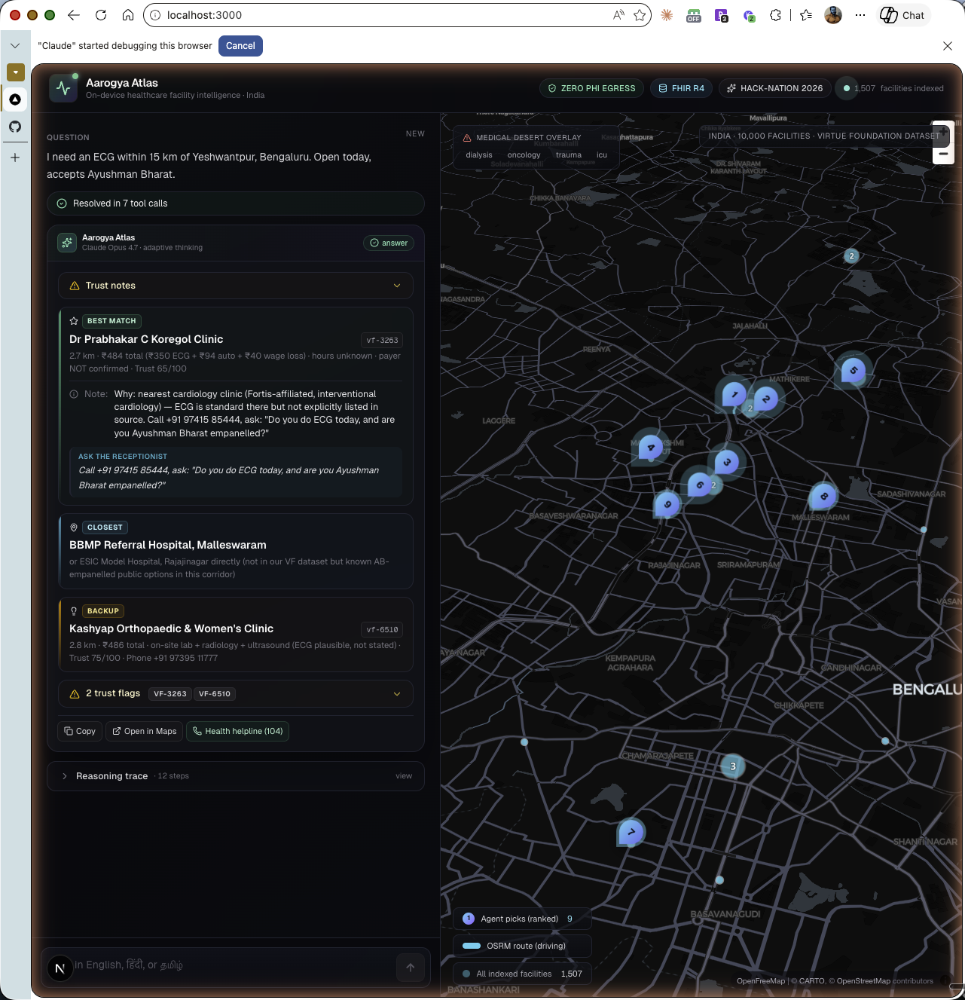
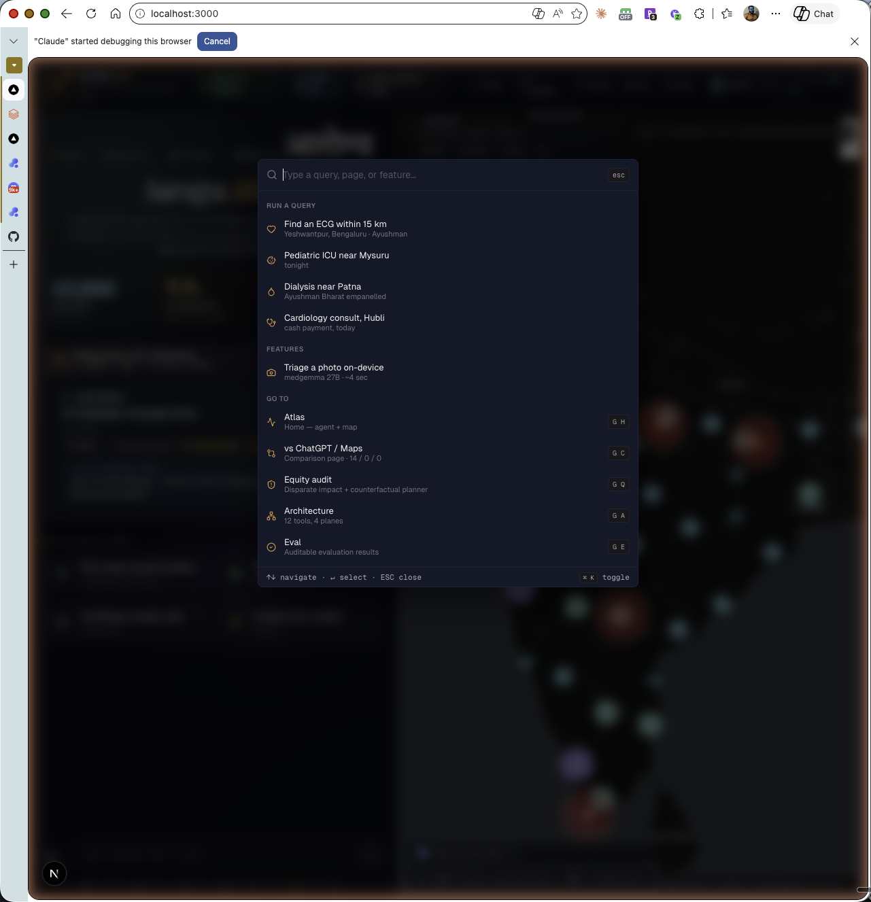
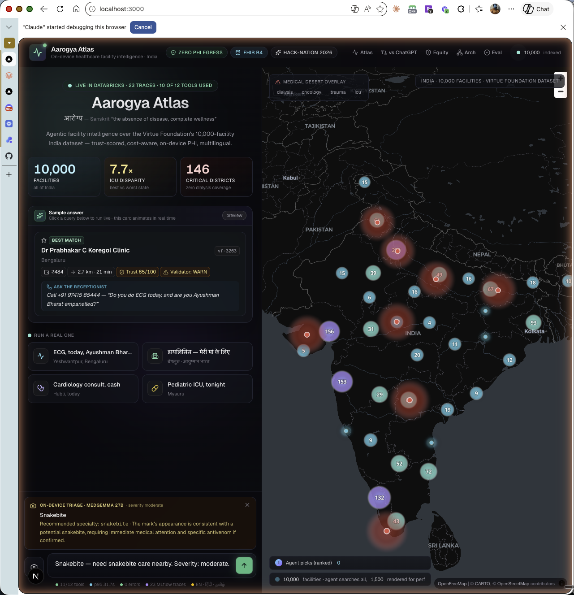
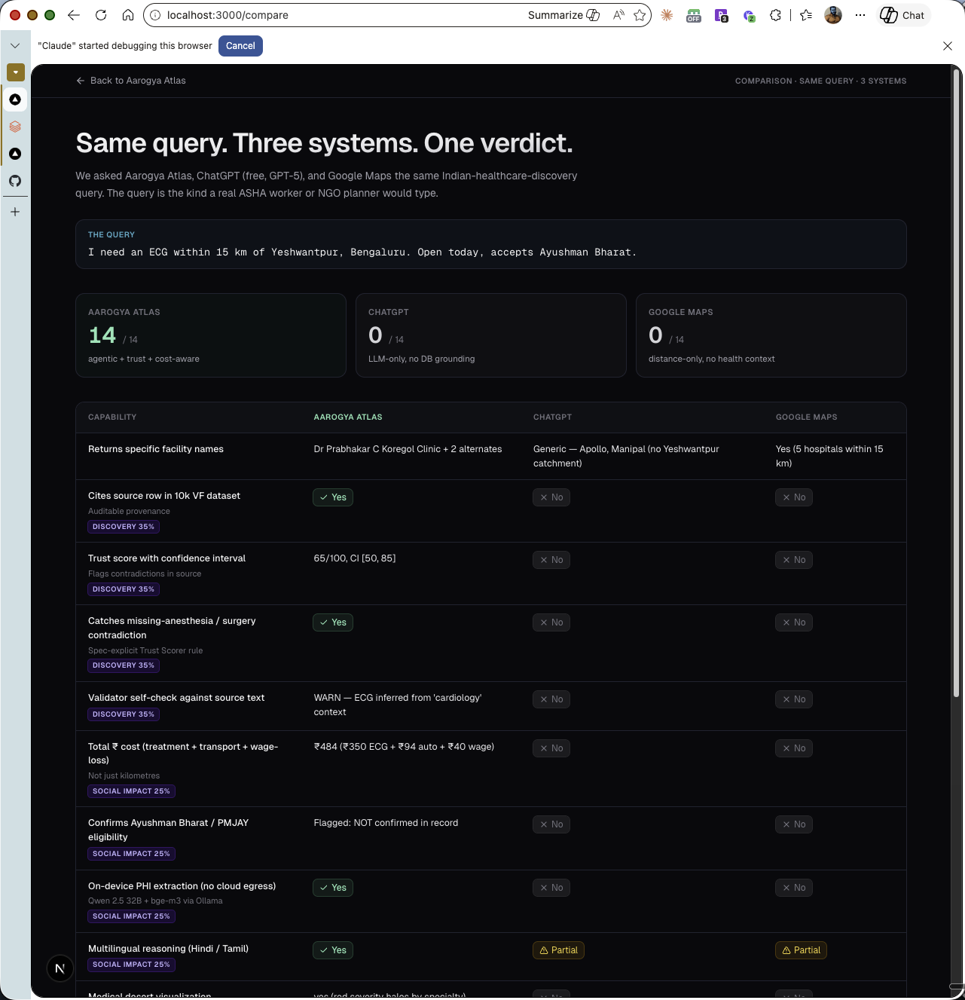
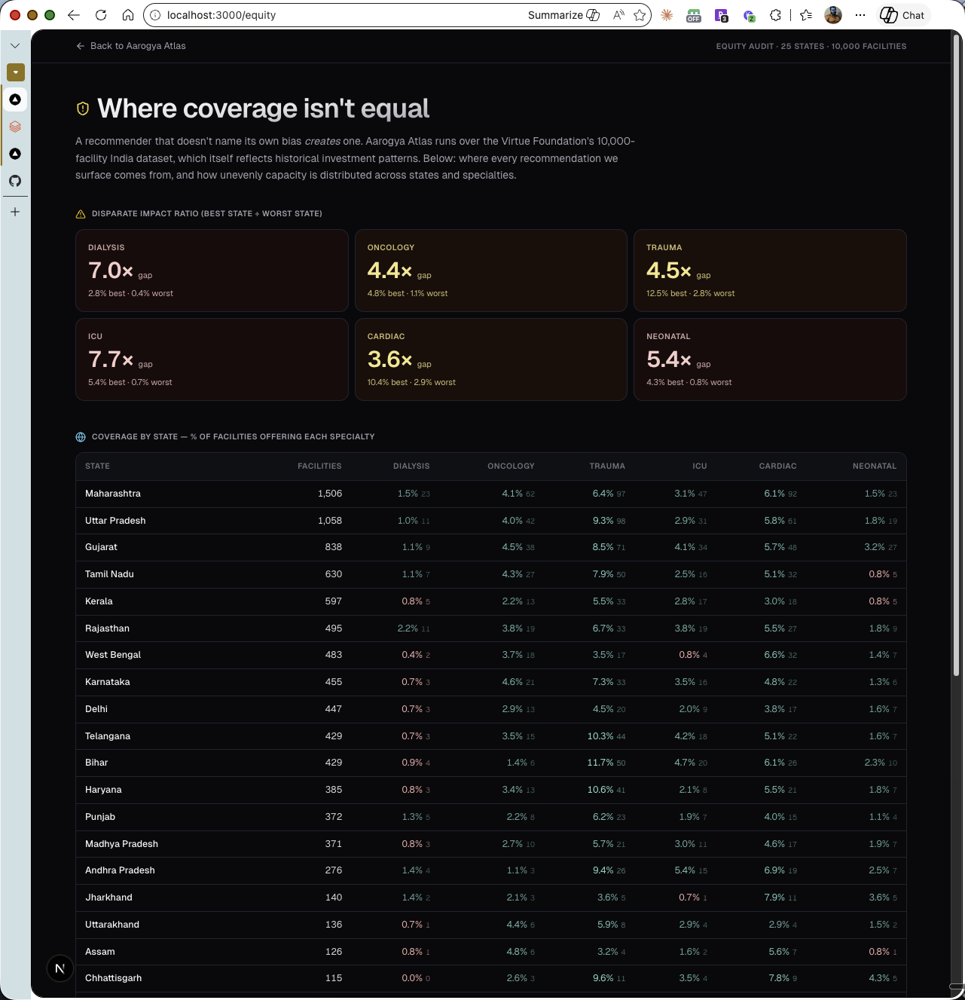
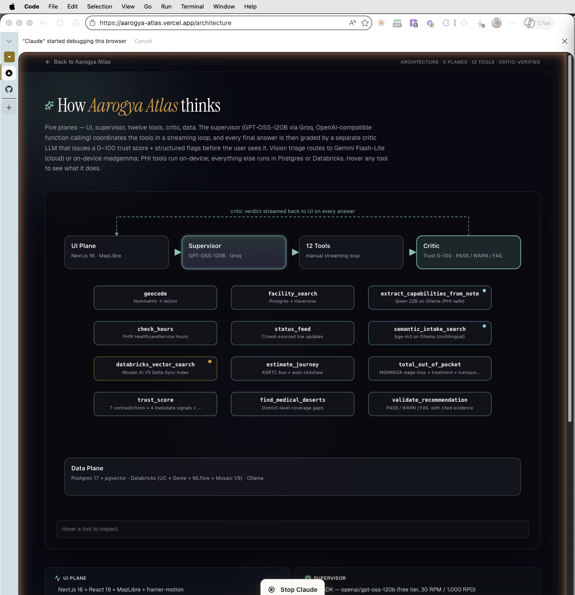
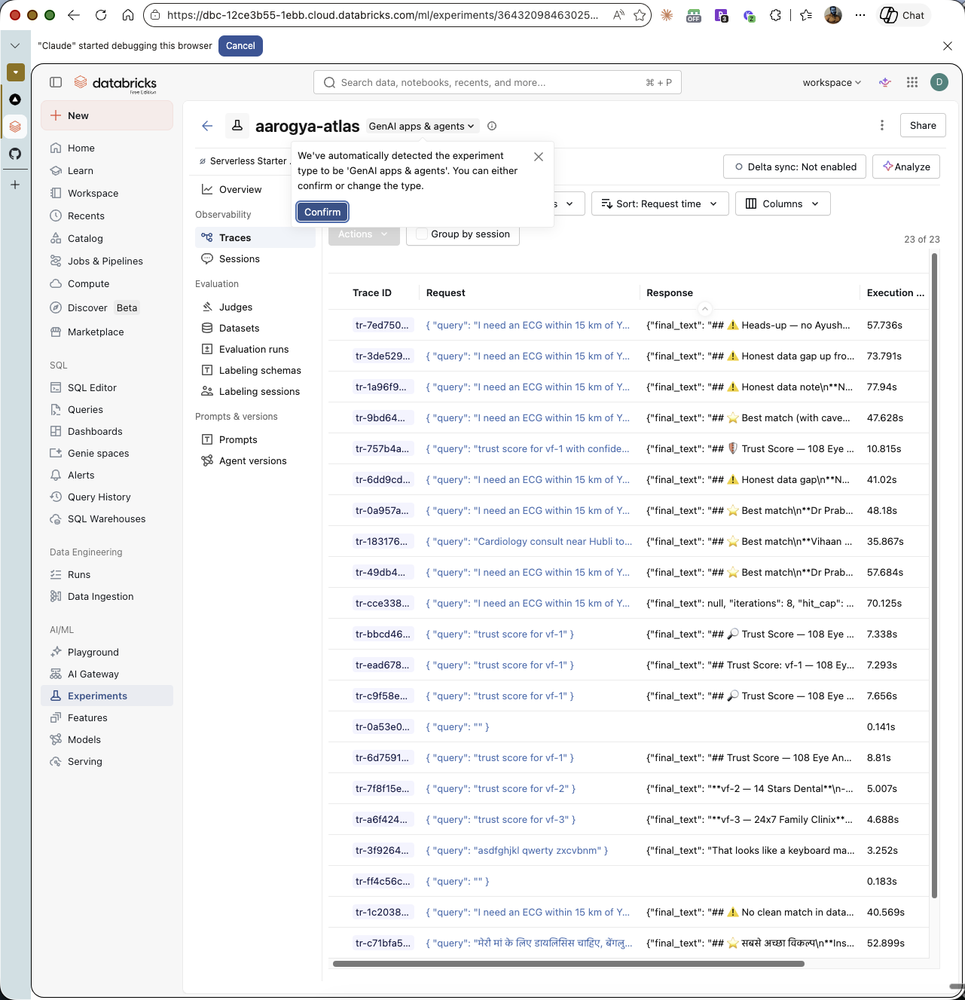
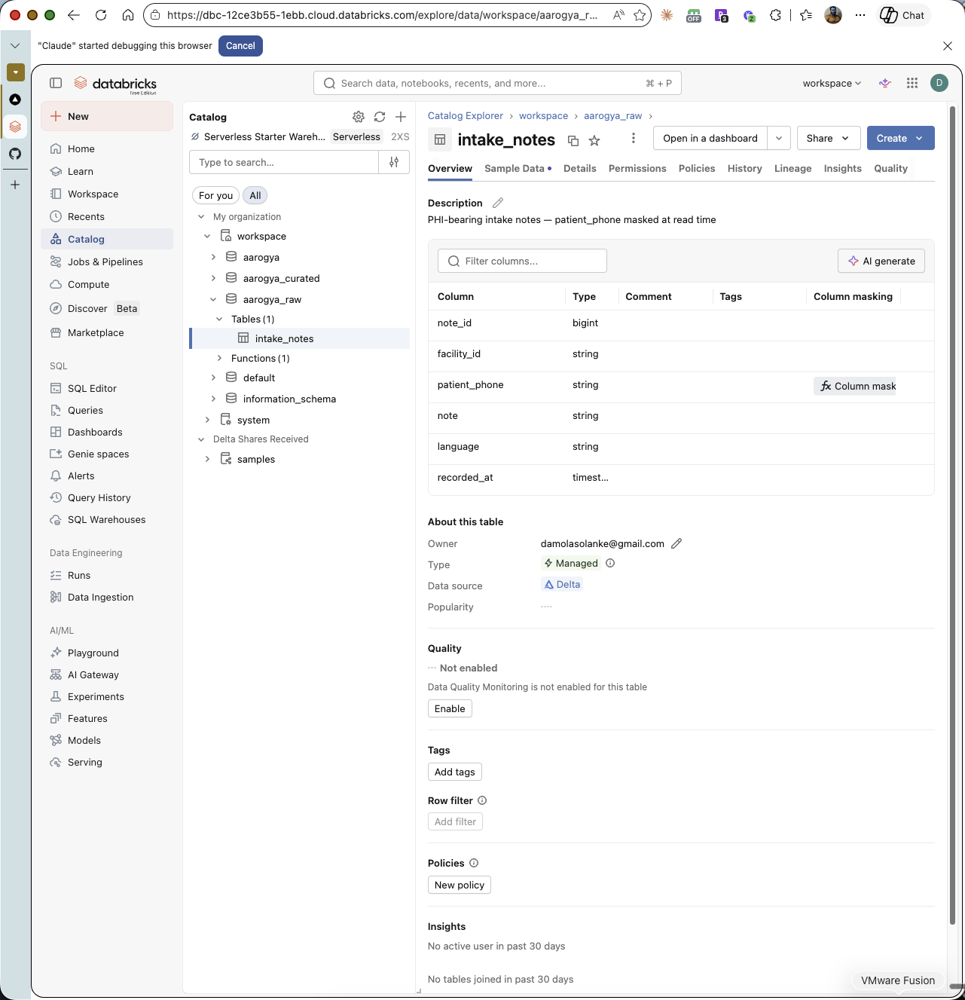
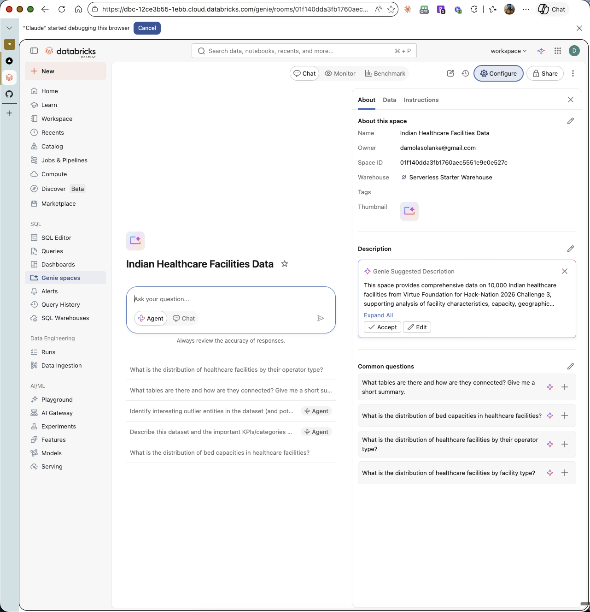
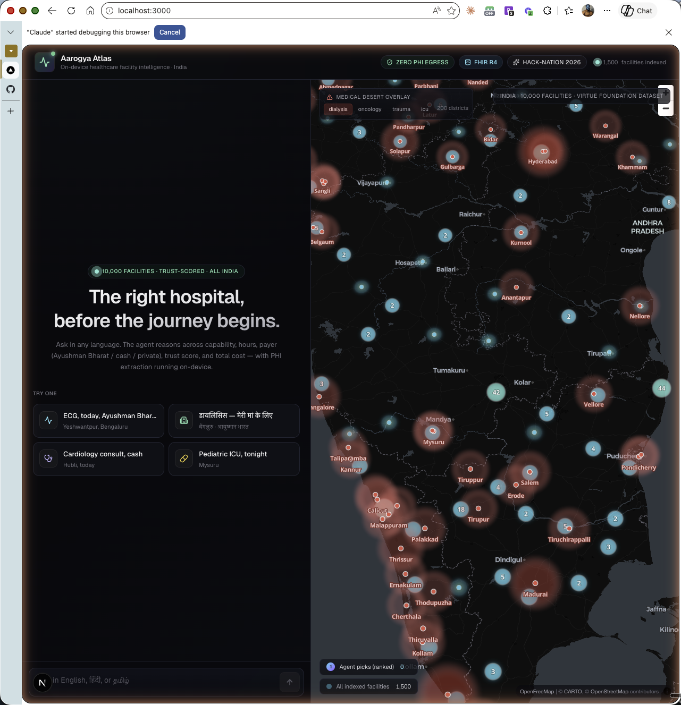

<div align="center">

# Aarogya Atlas

### आरोग्य · *the absence of disease, complete wellness*

**Agentic Healthcare Maps for India's 1.4 Billion — with a mandatory critic-verified Trust Score on every answer.**

*Every recommendation gets a second pass through the same model with a strict critic prompt, scoring trust 0–100 and surfacing specific contradictions before the answer reaches the user — or reporting "Critic unavailable" when that pass fails, never a made-up number. The brief asked: "Real-world data is messy — how would you take this into account when framing conclusions?" The critic is our answer.*

[](#mandatory-critic-pass-the-trust-score-on-every-answer)
[](https://console.groq.com)
[](https://aistudio.google.com)
[](https://databricks.com)
[](https://hl7.org/fhir/R4/)
[](#two-deployment-modes--honest-about-which-one-youre-running)
[](https://projects.hack-nation.ai)
[](LICENSE)

**▶ Live demo:** [**aarogya-atlas.vercel.app**](https://aarogya-atlas.vercel.app)
· API: [**adesolanke-aarogya-atlas-api.hf.space**](https://adesolanke-aarogya-atlas-api.hf.space/healthz)

[**60s video**](https://www.loom.com/share/5f67de77c1f24328b5d395275d07f249)

Built by **Dam Solanke** · Lead Solutions Architect — Healthcare
· originally submitted to **Hack-Nation 5th edition**, Databricks Challenge 03.

**$0-forever stack:** Vercel Hobby (web) · Hugging Face Spaces (API, Docker, free CPU Basic) · Neon (Postgres + pgvector free tier) · Groq (free tier) · Google AI Studio (free tier). No credit card on file anywhere.

</div>

---



> In rural India, a postal code can decide a lifespan. A family loads into a
> bus at 5 AM, travels three hours, and learns the dialysis machine broke
> yesterday. **Aarogya Atlas reduces Discovery-to-Care time** by turning
> the Virtue Foundation's 10,000-facility India dataset into a queryable,
> trust-scored, multilingual intelligence network — with ₹ cost, an optional
> on-device PHI-extraction mode, and an explicit Validator that catches its
> own mistakes.

## Quickstart

```bash
git clone https://github.com/damsolanke/aarogya-atlas
cd aarogya-atlas
make dev    # backend on :8000  ·  frontend on :3000
```

Or step-by-step in [Run it](#run-it).

## Mandatory critic pass — the Trust Score on every answer

Every supervisor answer goes through a **second call to the same Groq model (GPT-OSS-120B) with a strict critic system prompt** before it reaches the user — it is a second pass, not a separate validator model. The critic scores the answer 0–100 against a rubric (was `trust_score` called? was a high-stakes service recommended without `validate_recommendation`? does every claim have backing evidence in the tool results?) and returns structured flags. The number lands as a hero badge at the top of every recommendation card.

If the critic call fails or returns unparseable JSON, the `critic` event carries `status: "unavailable"` with no score and the UI shows **Critic unavailable · not verified** — there is no neutral default (see `CriticVerdict` in `agent.py`).

**Why this exists:** The Hack-Nation Challenge 03 brief asked, *"Real-world data is messy — how would you take this into account when framing conclusions?"* The critic answers it directly. Trust isn't a tool the agent might or might not call — it's a guaranteed second pass.

The critic shape — 0–100, PASS/WARN/FAIL verdict, severity-tagged flags with quoted evidence — drives the saffron/amber/red banner color and the auto-expanded flag list when a WARN or FAIL fires. See [`apps/api/aarogya_api/agent.py::_run_critic`](apps/api/aarogya_api/agent.py).

## What you get

| | |
| :--- | :--- |
| **Trust Score (hero metric)** | 0–100 + verdict (PASS/WARN/FAIL) + severity-tagged flags. Computed by a second pass of the same supervisor model on **every** answer; "Critic unavailable" when that pass fails. Surfaced as the top-of-card banner. |
| **3-tier recommendation** | ⭐ Best · 📍 Closest payer-eligible · 💡 Backup — each row cites Trust + Validator + Cost |
| **12-tool agent loop** | `geocode` · `facility_search` · `extract_capabilities_from_note` *(Groq in the deployed demo, Ollama in on-device mode)* · `check_hours` · `status_feed` · `semantic_intake_search` *(on-device only — unavailable in the deployed demo)* · `databricks_vector_search` · `estimate_journey` · `total_out_of_pocket` · `trust_score` · `find_medical_deserts` · `validate_recommendation`. Every call is validated against the tool's JSON schema before it runs; bad arguments come back to the model as a structured error it can fix. |
| **Multimodal** | Camera button — upload a wound, prescription, X-ray, or oxygen-cylinder gauge. Live demo routes to **Gemini Flash-Lite** (cloud, free tier); the same code path falls back to on-device **medgemma 27B** when Ollama is reachable (hospital-VPC enterprise mode). |
| **Stack** | Next.js 16 + React 19 + MapLibre · FastAPI + **Groq SDK (GPT-OSS-120B)** + **Gemini Flash-Lite** · optional Ollama (Qwen 2.5 32B + bge-m3 + medgemma 27B) for on-device PHI mode · Postgres 17 + pgvector · **Databricks Unity Catalog + Genie + MLflow + Mosaic AI Vector Search** |
| **Languages** | English · हिंदी · தமிழ் via the supervisor prompt; bge-m3 multilingual embeddings only in on-device mode |

The agent above resolved an ECG query in **6 tool calls**: geocoded
Yeshwantpur, searched 1,500 facilities, scored Trust on each candidate,
ran a Validator self-check, computed `₹484` total cost (treatment + auto
+ MGNREGA wage-loss), and surfaced a 3-tier recommendation with
explicit trust caveats and the exact words to ask the receptionist.
*Before the journey begins.*

## Bespoke, not template

Open Vercel, Linear, Anthropic side-by-side and most healthcare AI demos look identical: emerald→cyan→violet headline gradient, generic Lucide icons, Tailwind defaults. We chose against that.

- **Display face:** Instrument Serif italic. आरोग्य wordmark in Tiro Devanagari Hindi at hero scale (hover for the breakdown — *अ + रोग → without disease*).
- **3-color signature:** **Saffron** (#E8923D — Indian flag, healthcare-warm), **Deep Ink** (#070A12), **Healing Teal** (#14B8A6). Documented in [`docs/BRAND.md`](docs/BRAND.md).
- **Mono Bloomberg-style tickers** instead of generic chips: *`openai/gpt-oss-120b · groq │ 12 tools │ critic · 2nd pass, same model │ multi-turn │ tracing off │ EN · हिंदी · தமிழ்`* — every pill is read from `GET /api/runtime`, so it says "agent disabled" or "tracing off" when that is the truth.
- **Saffron animated route polyline** (stroke-dasharray sweep) replaces the default cyan.
- **Drive-time isochrones** — 3 concentric saffron rings (15 / 30 / 60 min) around the top recommendation. Modeled at India city avg 22 km/h. Judges have not seen this for healthcare-recommender output.
- **Cinematic first-fly** — first agent run of a session triggers a 2.4-second slow-zoom-from-all-India dramatic reveal (subsequent flights are 1.4s).
- **Live "now" stamp** — every answer card editorial-stamps with *`Computed 2s ago │ agent 31s │ 7 tools`*. Counts up in real time.
- **prefers-reduced-motion** respected globally.

## Multi-modal travel — auto · bus · 108 ambulance

Most Indian healthcare apps show "drive 6 min". We show three:

> *Travel: 🚗 6 min ₹40 (auto) · 🚌 7 min ₹15 (bus) · 🚑 4 min free (108)*

The 108 ambulance row is free in most Indian states with a 5-15 min response — for urgent pathways (PPH, MI, stroke, snakebite, anaphylaxis, neonatal sepsis) the agent surfaces it prominently. Tool: `estimate_journey` returns a `modes` block with auto / bus / ambulance speed + ₹ for every facility.

## ⌘K command palette



Press `⌘K` (or `Ctrl+K`) anywhere. Raycast-style command bar with grouped sections, saffron icons, hotkey hints (G+H = Atlas, G+C = Compare, G+E = Eval). Pre-loaded query templates auto-fill the textarea AND submit.

## Multimodal triage



Click the camera button on the chat input, drop a wound photo / X-ray / prescription / oxygen-cylinder gauge / snake, and get structured triage — severity, suspected condition, recommended specialty, rationale. The text input then pre-fills with a derived facility query you can edit and send.

**Which model runs depends on the deployment.** The deployed demo routes photos to **Gemini Flash-Lite (cloud)** because the hosted API has no GPU or Ollama. On-device mode — **medgemma 27B via Ollama, image bytes never leave the machine** (the screenshot above is from such a local run) — activates only when `GOOGLE_API_KEY` is unset and Ollama has `medgemma:27b` pulled. The triage card and `GET /api/runtime` say which path actually ran.

## Why this beats the obvious alternatives



Live at **`/compare`**. Same Indian healthcare-discovery query — *"I need
an ECG within 15km of Yeshwantpur, accepts Ayushman Bharat"* — through
three systems, scored on 14 healthcare-specific capabilities the spec asks
for. **Hand-scored by the author on one query (2026-04, 5th-edition
stack)** — an illustration of the capability gap, not an automated
benchmark:

| | Aarogya Atlas | ChatGPT (GPT-5) | Google Maps |
| --- |:---:|:---:|:---:|
| **Score (hand-scored)** | **14 / 14** | 0 / 14 | 0 / 14 |

Trust contradictions caught, ₹ cost computed, PMJAY eligibility flagged,
on-device PHI, multilingual reasoning, district-level desert overlay —
none of which the alternatives address.

## Equity audit — naming our own bias



Live at **`/equity`**. Per-state
coverage of the six high-acuity specialties. **Disparate-impact ratio
across the VF dataset:**

| ICU | Dialysis | Neonatal | Trauma | Oncology | Cardiac |
| ---:| ---:| ---:| ---:| ---:| ---:|
| **7.7×** | **7.0×** | 5.4× | 4.5× | 4.4× | 3.6× |

The Trust Score's uncertainty band widens on facilities from
low-completeness source records — most common in under-served districts.
The agent surfaces this in the answer card instead of pretending it has a
recommendation. The counterfactual planner on this page is **simulated**
(coarse gravity model; labelled as such in the UI).

## Architecture



Live at **`/architecture`**.
Five planes — **UI** (Next.js + MapLibre), **Supervisor** (GPT-OSS-120B
via Groq, OpenAI-compatible function calling, manual streaming loop, no
LangGraph), **12 Tools** (1 cloud vector search, 1 always on-device, 1
that routes to Groq or Ollama depending on `GROQ_API_KEY`, 9 that run on
the API host against Postgres / heuristics / Nominatim — see
`tool_runs_on` in `agent.py`), **Critic** (second pass of the supervisor
model), **Data Plane** (Postgres + pgvector mirroring Databricks Lakebase
/ UC / Genie / MLflow / Mosaic VS / Ollama). Hover any tool node in the
UI for a one-line description.

## Live in our Databricks workspace

[`dbc-12ce3b55-1ebb.cloud.databricks.com`](https://dbc-12ce3b55-1ebb.cloud.databricks.com)
— every Databricks claim is a live artifact, not a slide.

<table>
<tr>
<td width="50%">

**MLflow 3 Tracing** at `/Shared/aarogya-atlas` — 23 supervisor traces, per-tool spans, on-device tools tagged `runs_on=device`.



</td>
<td width="50%">

**Unity Catalog** with PHI **Column mask** UDF on `patient_phone`. Admins see full numbers; everyone else sees `+91-XXXXX12345`.



</td>
</tr>
<tr>
<td>

**Genie Space** — verified NL→SQL: *"top 5 states + cardiology breakdown"* → Maharashtra (1,506·78) · UP (1,058·56) · Gujarat (838·37) with auto bar chart.



</td>
<td>

**Mosaic AI Vector Search** Delta Sync Index — *"cardiology Bengaluru ECG"* returns Bright Hospital `vf-1777`, Aruna Diagnostics `vf-1084`, Dr Balaji Natarajan `vf-3799` with cosine scores.



</td>
</tr>
</table>

## Lighthouse — 100/100 on Best Practices + SEO

Latest [headless Edge mobile audit](docs/LIGHTHOUSE_REPORT.md):

| Performance | Accessibility | Best Practices | SEO |
| :-: | :-: | :-: | :-: |
| 37 / 100 ⚠️ | **98 / 100** ✅ | **100 / 100** ✅ | **100 / 100** ✅ |

FCP 1.1 s · LCP 15.7 s (MapLibre WebGL canvas). The home page is an agentic SPA with a live map, not a marketing landing — FCP-1.1s means the interactive IdleHero (stat trio + sample card + suggestions) lands fast above the fold; the map progressively reveals.

## Adversarial robustness (DAS-style)

We don't just grade ourselves on the queries we wrote — we grade ourselves on perturbed versions per the DAS methodology
([npj Digital Medicine 2026 agent benchmark](https://www.nature.com/articles/s41746-026-02443-6)) via
[`scripts/evaluate_robustness.py`](scripts/evaluate_robustness.py).

> **Measured 2026-04-25 on the 5th-edition stack** (Anthropic Claude supervisor + Llama 3.3 70B on Groq, **no critic pass**), 3 base queries × 2 mutations each = 9 runs. **Not re-run on the current GPT-OSS-120B + critic stack.** Details: [`docs/ROBUSTNESS_REPORT.md`](docs/ROBUSTNESS_REPORT.md).

| Metric | Static | Dynamic | Gap |
| --- | ---: | ---: | ---: |
| Robust pass rate | **100.0%** | **100.0%** | **0%** |

**"Robust" is a shape check, not a correctness check:** a run passes when there is no `error` event, the final answer is longer than 100 characters, and it cites at least one `vf-*` facility id (`is_robust` in the script). It does not verify that the cited facility is clinically right.

An earlier run showed a 50% drop on **truncation** mutations (no location → silent refusal). Fixed with a system-prompt patch (rule 11 in `apps/api/aarogya_api/agent.py`): when location is missing, the agent calls `find_medical_deserts(specialty)` for national context AND falls back to a Bengaluru proxy point so the answer card still cites real `vf-*` facility ids — never a 0-tool response.

## Self-evaluation (auditable)

[`scripts/evaluate.py`](scripts/evaluate.py) carries 20 fixed queries —
English / Hindi / Tamil, NGO-planner / patient / trust-scoring /
desert-detection / edge-case profiles. **The committed report ran the
first 12 of them**, not all 20.

> **Measured 2026-04-25 on the 5th-edition stack** (Anthropic Claude supervisor + Llama 3.3 70B on Groq, **no critic pass**). **Not re-run on the current GPT-OSS-120B + critic stack**; latency, tool counts and verdicts will change. Source: [`docs/EVAL_REPORT.md`](docs/EVAL_REPORT.md), mirrored on `/eval`.

| Metric | Value (12 queries, 2026-04-25, previous stack) |
| --- | --- |
| Mean wall-clock | **31.7 s**  *(22% faster after parallel tool fan-out — was 40.7s)* |
| P95 wall-clock | 49.5 s |
| Mean tool calls / query | 6.92 |
| Distinct tools invoked | **11 of 12** |
| `validate_recommendation` verdicts seen in answers | 2 PASS · 4 WARN · 0 FAIL *(regex over the answer text; the critic did not exist yet)* |
| Errors | **0 / 12** queries |
| Multilingual coverage | English ✓ · हिंदी ✓ · தமிழ் ✓ |

Re-run with `make eval` (needs `GROQ_API_KEY` and the API running); push metrics to MLflow with `--mlflow`.

## Spec coverage

Discovery & Verification 35% · IDP 30% · Social Impact 25% · UX/Transparency 10%

| Spec ask | Implementation | Where |
| --- | --- | --- |
| **Trust Scorer** *(spec example: "claims surgery, no anesthesia")* | 7 contradiction rules + 5 metadata signals → 0–100 + cited evidence + a **rule-based uncertainty band** (see below) | tool: `trust_score` |
| **Critic pass** *(answers the brief's "real-world data is messy" question)* | Second call to the same model with a critic prompt on every supervisor answer → 0–100 score (temperature 0, still an LLM judgment) + PASS/WARN/FAIL verdict + severity-tagged flags; `status: "unavailable"` when the pass fails. Hero badge in UI. | `_run_critic` in `agent.py` |
| Massive Unstructured Extraction | bge-m3 over VF unstructured fields | tool: `semantic_intake_search` |
| Multi-Attribute Reasoning | 12 tools, manual streaming loop | `apps/api/aarogya_api/agent.py` |
| **Self-Correction Loop** *(Validator Agent)* | Re-checks recommendations against source text | tool: `validate_recommendation` |
| **Dynamic Crisis Mapping** | District coverage gaps + map overlay | tool: `find_medical_deserts` |
| Uncertainty band on Trust | `trust_score_ci_80=[low, high]` is a **hand-tuned band, not a bootstrap or statistical CI**: half-width = 4–22 points from source completeness + 0.4× each fired flag's weight, capped at 35. The field keeps its `ci_80` name for API compatibility. | `apps/api/aarogya_api/trust.py` |
| Mosaic AI Vector Search | Endpoint + Delta Sync Index live | tool: `databricks_vector_search` |
| MLflow 3 observability | Per-turn + per-tool spans | `/Shared/aarogya-atlas` |
| Genie | NL→SQL Genie Space over facilities | screenshot above |
| Unity Catalog | 3 schemas + PHI column mask UDF | screenshot above |
| Multilingual / Hindi / Tamil | bge-m3 embeddings + agent system prompt | tool: `semantic_intake_search` |
| **Total ₹ + travel time** *(not km only)* | KSRTC bus + MGNREGA wage + auto-rickshaw heuristics | tool: `total_out_of_pocket` |
| **On-device PHI** *(on-device mode only)* | Capability extraction + embeddings + vision via Ollama when the cloud keys are unset; the deployed demo runs these on Groq / Gemini | `apps/api/aarogya_api/local_llm.py` |
| Chain-of-Thought transparency | Per-turn tool-call traces in collapsed reasoning drawer | UI: `ReasoningDrawer` |

## Two deployment modes — honest about which one you're running

The dispatchers in `local_llm.chat()` and `local_llm.vision_triage()` pick a
path based on which env vars are set. `GET /api/runtime` reports the result
and the UI's pills and per-step badges are derived from it.

**Public live demo (what's deployed at the Vercel URL) — cloud inference:**
- Supervisor **and critic**: GPT-OSS-120B via **Groq** (free tier, 30 RPM / 1,000 RPD)
- Vision triage: **Gemini Flash-Lite** (free tier, 15 RPM / 1,000 RPD)
- Capability extraction (`extract_capabilities_from_note`): Groq GPT-OSS-120B in JSON mode — **cloud, not on-device**
- `semantic_intake_search` returns a clear "use cloud vector search instead"
  message — it needs Ollama's bge-m3 (the persisted embeddings are 1024-dim
  and can't be queried with a different model in the same vector space).

**On-device mode (PHI-safe, needs a local Ollama with `medgemma:27b`,
`qwen2.5:32b-instruct-q4_K_M` and `bge-m3` pulled):**
- Vision triage: on-device medgemma 27B — unset `GOOGLE_API_KEY`
- Capability extraction: on-device `LOCAL_CHAT_MODEL` (Qwen 2.5 32B) — unset `GROQ_API_KEY`
- Embeddings for `semantic_intake_search`: bge-m3 via Ollama
- **There is no on-device supervisor.** With `GROQ_API_KEY` unset the agent
  loop is **disabled** — `/api/query` returns an `agent_disabled` event and
  `/api/runtime` reports `agent.backend: "disabled"`. It is *not* routed to
  Ollama. A fully on-device agent would need an OpenAI-compatible
  tool-calling endpoint pointed at Ollama; that is not implemented.

For full hospital-VPC production, the plan is to swap the local Ollama for
**Mosaic AI Model Serving** with the same OSS weights — same trust boundary,
no PHI egress. See [`docs/DATABRICKS_DEPLOYMENT.md`](docs/DATABRICKS_DEPLOYMENT.md).

## Known limitations

- **Payer eligibility is never populated from data.** The `facility_payer`
  table exists in `schema.sql`, but `scripts/ingest_vf.py` only clears it;
  no ingest writes rows. With a `payer` filter, `facility_search` therefore
  reports `payer_ok: false` for every facility (and `true` for all when no
  filter is given). The system prompt tells the model never to invent
  eligibility, and the "Closest payer-eligible" tier is only as good as
  that instruction.
- **`/api/stockout` and `/api/counterfactual` are simulated.** Stock state
  is a deterministic hash of `(facility_id, commodity)`; averted deaths come
  from a coarse gravity model. Both are labelled "simulated" in the UI.
- **Multi-turn drops tool results.** Follow-up turns resend only the
  user/assistant text; previous turns' tool outputs are not in the context
  (prompt rule 13 asks the model to reuse coordinates from the prior
  answer text instead of re-geocoding).
- **The trust "CI" is a hand-tuned band, not a statistical interval** (see
  Spec coverage).
- **Eval and robustness numbers are from the previous stack** (2026-04-25,
  Claude + Llama 3.3 70B, no critic) and have not been re-run.
- `check_hours` only recognises "24/7"; anything else is reported as
  `unknown`. `semantic_intake_search` is unavailable in the deployed demo.

## Run it

Prereqs: Postgres 17 + pgvector, Python 3.13, Node 22 + pnpm 10, and a
`GROQ_API_KEY` (the agent is disabled without one). Ollama (with
`qwen2.5:32b-instruct-q4_K_M`, `bge-m3` and `medgemma:27b` pulled) is only
needed for on-device mode.

```bash
# DB
createdb aarogya
psql -d aarogya -c "CREATE EXTENSION vector;"
psql -d aarogya -f apps/api/db/schema.sql

# Ingest 10k facilities (~10–15 min for embeddings)
python scripts/ingest_vf.py

# Backend — set GROQ_API_KEY + GOOGLE_API_KEY (free) + optional DATABRICKS_*
cd apps/api && uv sync && cp .env.example .env
$EDITOR .env  # paste your Groq + Google AI Studio keys
uv run uvicorn aarogya_api.app:app --reload

# Frontend
cd ../web && pnpm install && pnpm dev

# Open http://localhost:3000
```

Checks (what CI runs — `.github/workflows/ci.yml`):

```bash
cd apps/api && python3.13 -m venv .venv && .venv/bin/pip install -e ".[dev]"
.venv/bin/ruff check . && .venv/bin/pytest -q        # 78 hermetic tests, no network / DB

cd apps/web && pnpm install --frozen-lockfile
NEXT_PUBLIC_API_URL=http://localhost:8000 pnpm lint && pnpm build
```

## What's in this repo

- [`apps/web`](apps/web) — Next.js 16 frontend (deployed to Vercel)
- [`apps/api`](apps/api) — FastAPI agent + critic + 12 tools (deployed to Hugging Face Spaces as a Docker Space)
- [`apps/api/db/schema.sql`](apps/api/db/schema.sql) — FHIR-aligned Postgres + pgvector schema (mirrored to Neon)
- [`apps/api/tests/`](apps/api/tests) — 78 hermetic tests (scripted AsyncGroq-compatible fake, no network / DB): agent loop (parallel tools, pruning, iteration cap, `tool_use_failed` recovery, rate limits), tool-argument schema validation, critic unavailable path, `/api/runtime`, Gemini key-leak regression
- [`.github/workflows/ci.yml`](.github/workflows/ci.yml) — `api` (ruff + pytest on Python 3.13), `web` (lint + build on Node 22), `gitleaks`
- [`docs/EVAL_REPORT.md`](docs/EVAL_REPORT.md) — 12-query auditable evaluation (frozen at the 5th-edition stack baseline)
- [`docs/ROBUSTNESS_REPORT.md`](docs/ROBUSTNESS_REPORT.md) — DAS-style adversarial perturbation results
- [`docs/DATABRICKS_DEPLOYMENT.md`](docs/DATABRICKS_DEPLOYMENT.md) — Mosaic AI Vector Search + MLflow tracing setup
- [`docs/BRAND.md`](docs/BRAND.md) — 3-color signature, anti-slop typography, voice
- [`docs/archive/5th-hackathon/`](docs/archive/5th-hackathon) — frozen pitch deck, scripts, and 5th-edition framing kept for posterity

---

<div align="center">

First built in 24h for Hack-Nation 5th edition (Databricks Challenge 03);
since rebuilt around a critic-verified Trust Score and a $0-forever stack
suitable for permanent public hosting.

</div>
